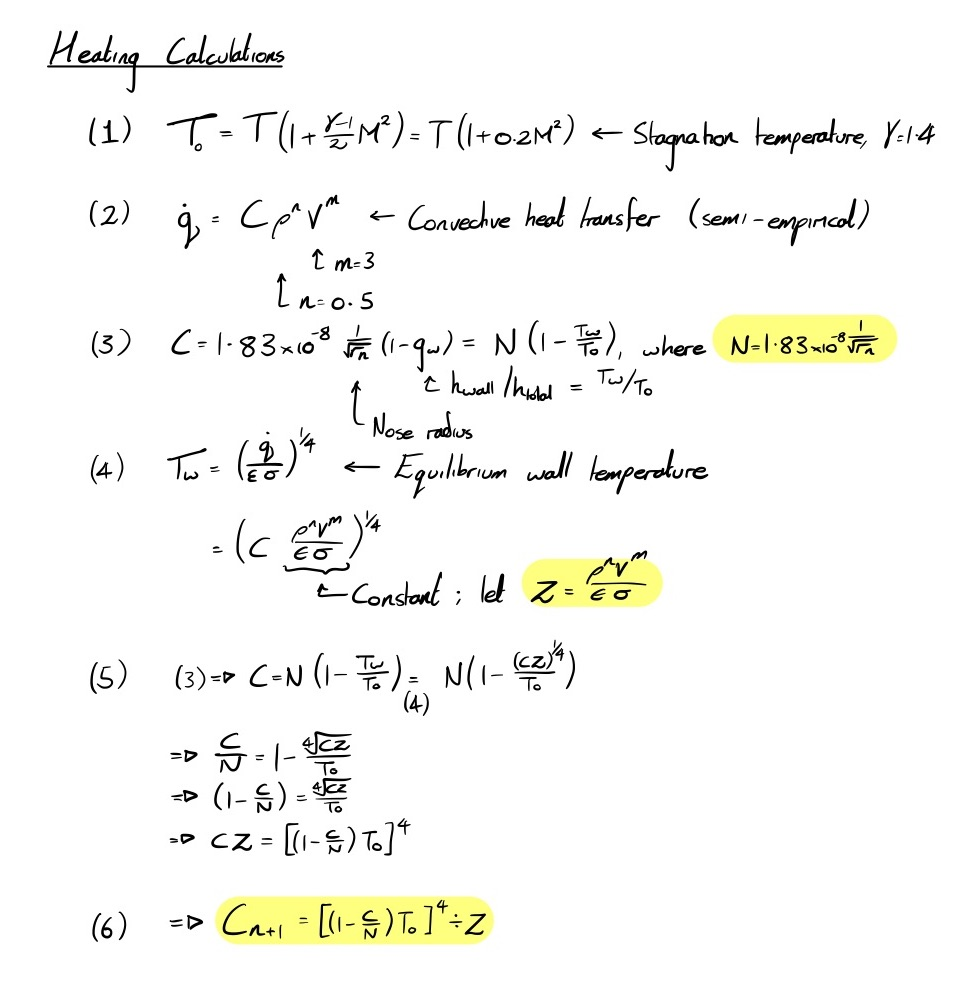

# Body heating calculations

Various heating calculation scripts. An analytical solution is currently under development

**Do not use iterative scripts**

## Tip Heating Calculations

Using equations 1, 2, 3, and 4 (which can be found in the ICLR heating calculations wiki page), an iterative equation (5) can be developed to solve for equlibrium wall temperature.
This applies to any flow, although **these calculations have not yet been verified**
